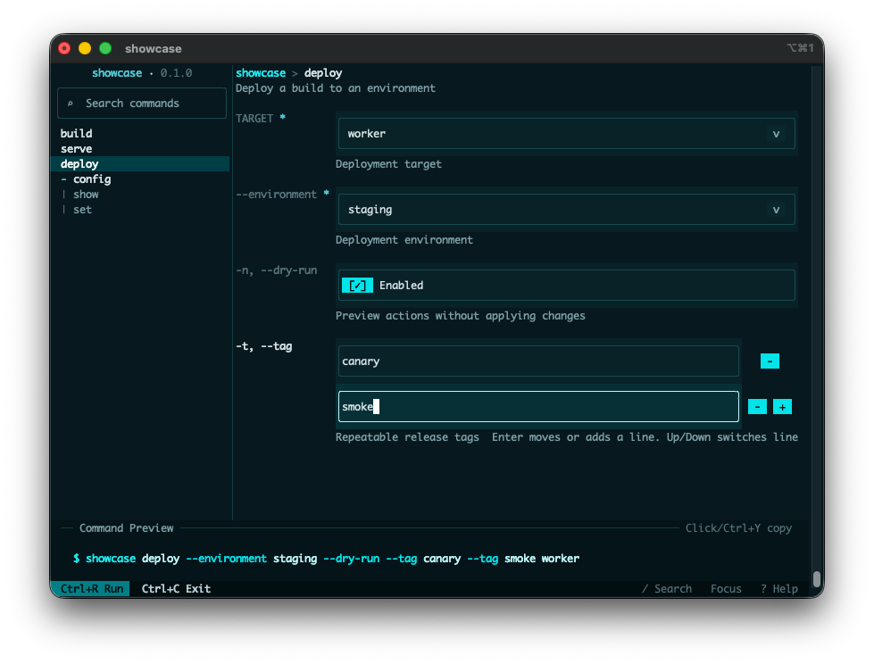

# clap-tui

`clap-tui` turns a `clap` CLI into an interactive terminal UI while preserving the original command-line interface. You can keep `clap` as the source of truth, collect input in a terminal form, and then continue your normal application dispatch with the selected typed command value.

This crate was heavily inspired by [Trogon](https://github.com/Textualize/trogon). `clap-tui` is a community crate and is not an official `clap` project.



## Add `clap-tui` to your project

```toml
[dependencies]
clap = { version = "4.5", features = ["derive", "env"] }
clap-tui = "0.1.0"
```

Minimum supported Rust version: `1.85`.

## Quick start

The recommended 0.1.0 integration model is an explicit `Command::Tui` dispatch branch that calls `Tui::<Command>::run()`.

```rust
use clap::Parser;
use clap_tui::Tui;

#[derive(Debug, Parser, PartialEq, Eq)]
#[command(name = "tool")]
enum Command {
    Tui,
    Hello {
        #[arg(long, default_value = "world")]
        name: String,
    },
}

fn dispatch(command: Command) {
    match command {
        Command::Tui => {}
        Command::Hello { name } => println!("Hello, {name}!"),
    }
}

fn main() -> Result<(), clap_tui::TuiError> {
    match Command::parse() {
        Command::Tui => {
            if let Some(command) = Tui::<Command>::new().run()? {
                dispatch(command);
            }
        }
        command => dispatch(command),
    }

    Ok(())
}
```

`Tui::<T>::run()` returns:

- `Ok(Some(T))` when the user submits a valid command
- `Ok(None)` when the user cancels before submission
- `Err(TuiError::Clap(_))` for clap help, version, and parse-display flows after argv exists
- another `TuiError` variant for terminal, rendering, runtime, or internal failures

## Choose an entrypoint

- Use `Tui::<T>::run()` when you want typed results from a derive-based clap parser.
- Use `TuiApp::from_command(...)` when you already have a hand-built `clap::Command` and want the untyped argv or `ArgMatches` flow.

## Supported customization seams

- `TuiConfig` controls theme, layout, key bindings, and initial command selection.
- `TuiApp::with_runtime(...)` and the exported `Runtime` event types support advanced runtime integration.
- `TuiConfig.start_command` lets you preselect a command path such as `build::release`.

Internal reducers, projections, render helpers, and other support modules are not stable extension points.

## Feature flags

- `mouse` is enabled by default and turns on mouse capture plus mouse-driven controls.

## Terminal expectations

- `clap-tui` is designed for interactive terminals that support raw mode and an alternate screen.
- The default `CrosstermRuntime` restores the terminal before returning, including when the user cancels.
- Mouse interactions require the default `mouse` feature.
- Validation stays inside the TUI flow: invalid forms show inline feedback instead of returning partially parsed values.

## Example guide

- `simple` shows the smallest explicit `Command::Tui` setup.
- `showcase` is the best starting point for demos and screenshots: it shows nested commands, dropdowns, text input, shared global fields, and a readable preview.
- `subcommands` shows explicit typed dispatch for a CLI with nested command trees.
- `kitchen_sink` demonstrates the untyped `TuiApp::from_command(...)` path and a wider range of `clap` surface area.

```bash
cargo run -p clap-tui --example simple -- tui
cargo run -p clap-tui --example showcase -- tui
cargo run -p clap-tui --example subcommands -- tui
cargo run -p clap-tui --example kitchen_sink
```

## Release verification

Maintainers can run `./scripts/verify-release-readiness.sh` for the same formatting, linting, test, dependency-graph, and package-surface checks that the GitHub `verify` workflow enforces. See `docs/release-readiness.md` for the release tag flow, crates.io owner setup, and the current publishing boundary.

## Theme presets

```rust
use clap_tui::{Theme, ThemePreset, TuiConfig};

let mut config = TuiConfig::default();
config.theme = Theme::from_preset(ThemePreset::Light);
```

Available presets:

- `ThemePreset::CalmDark` (default)
- `ThemePreset::HighContrastDark`
- `ThemePreset::Light`

## Controls

- `Tab` switches focus
- `Shift+Tab` cycles tabs
- `?` toggles the Help tab
- `/` opens command search
- `Ctrl+R` runs the current selection
- `Ctrl+Enter` runs when supported by the terminal
- `Ctrl+C` exits without running
- typing edits the focused field
